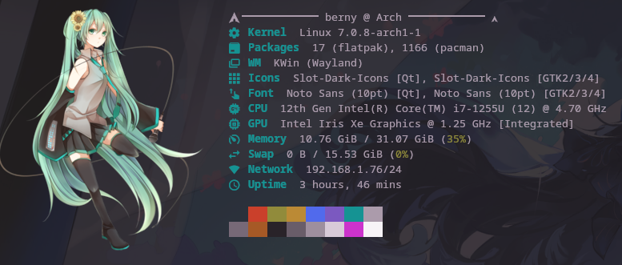
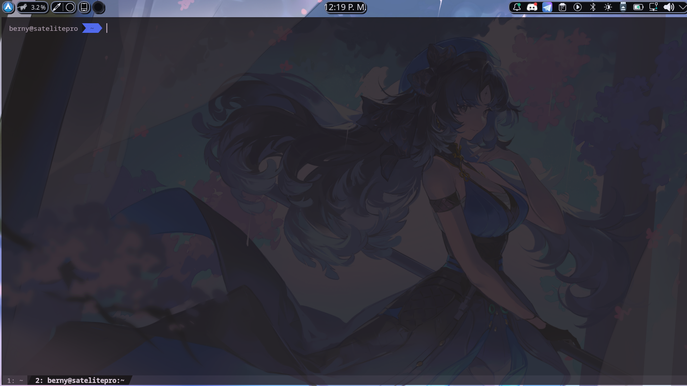

# Configuración de fastfetch y Kitty

personalizaciones de linux
---

## fastfetch

Muestra información del sistema al abrir la terminal. Usa imagen personalizada (Miku) renderizada con el protocolo gráfico de Kitty.

### Dependencias

```bash
pacman -S fastfetch
```

### Instalación

```bash
mkdir -p ~/.config/fastfetch
# copiar el directorio fastfetch
cp -r .config/fastfetch ~/.config/fastfetch

```

### Módulos que muestra

| Módulo    | Descripción              |
|-----------|--------------------------|
| Kernel    | Versión del kernel        |
| Packages  | Paquetes instalados       |
| WM        | Gestor de ventanas        |
| Icons     | Tema de iconos            |
| Font      | Fuente del sistema        |
| CPU       | Procesador                |
| GPU       | Tarjeta gráfica           |
| Memory    | RAM usada / total         |
| Swap      | Swap usada / total        |
| Network   | IP local                  |
| Uptime    | Tiempo encendido          |

### Notas

- El logo requiere que el terminal sea **Kitty** (usa `type: "kitty"` para el protocolo gráfico).
- Para cambiar la imagen, reemplaza `~/.config/fastfetch/images/miku.png` y ajusta `width`/`height` en `config.jsonc` si es necesario.
- Para ejecutarlo automáticamente al abrir la terminal, agrega `fastfetch` al final de `~/.zshrc` o `~/.bashrc`.

---

## kitty


Terminal emulador con soporte de GPU, protocolo gráfico, pestañas y alta personalización.

### Dependencias

```bash
pacman -S kitty

apt install kitty
```

> **Opcional:** instala una Nerd Font para ver los iconos correctamente (ej. JetBrains Mono Nerd Font).
> ```bash
> pacman -S ttf-jetbrains-mono-nerd
> ```

### Instalación

```bash
mkdir -p ~/.config/kitty
# copiar el directorio kitty
cp -r .config/kitty ~/.config/kitty
```

### Configuración principal (`kitty.conf`)

| Sección       | Opciones destacadas                                              |
|---------------|------------------------------------------------------------------|
| Fuente        | Tamaño 10pt. Descomenta `font_family` para usar Nerd Font.       |
| Ventana       | Padding de 4px, opacidad 85%, recuerda tamaño al reabrir.        |
| Tab bar       | Estilo powerline slanted en la parte inferior.                   |
| Scrollback    | 10 000 líneas de historial.                                      |
| URLs          | Subrayado curly, se abren con la app por defecto del sistema.    |
| Clipboard     | Copia automática al seleccionar texto.                           |
| Shell         | Usa `/usr/bin/zsh` con shell integration activada.               |
| Rendimiento   | Repaint delay 8ms, input delay 3ms, sincronizado al monitor.     |

### Atajos de teclado

| Atajo                | Acción                                      |
|----------------------|---------------------------------------------|
| `Ctrl+Shift+Enter`   | Nueva ventana en el directorio actual        |
| `Ctrl+Shift+T`       | Nueva pestaña en el directorio actual        |
| `Ctrl+=`             | Aumentar tamaño de fuente                    |
| `Ctrl+-`             | Reducir tamaño de fuente                     |
| `Ctrl+0`             | Restaurar tamaño de fuente                   |
| `Ctrl+Shift+K`       | Limpiar pantalla y scrollback                |
| `Ctrl+Shift+U`       | Scroll una página arriba                     |
| `Ctrl+Shift+D`       | Scroll una página abajo                      |
| `F11`                | Pantalla completa                            |
| `Ctrl+Shift+A M/L`   | Subir / bajar opacidad (dynamic opacity)     |

### Tema (`dark-theme.auto.conf`)

**Atelier Heath Dark** — fondo oscuro con tonos magenta/rojo fríos.

- Fondo: `#1b181b` · Texto: `#ab9bab`
- Generado con `kitten themes`. Para cambiarlo ejecuta:
  ```bash
  kitten themes
  ```
  Esto sobreescribe `dark-theme.auto.conf` automáticamente.
